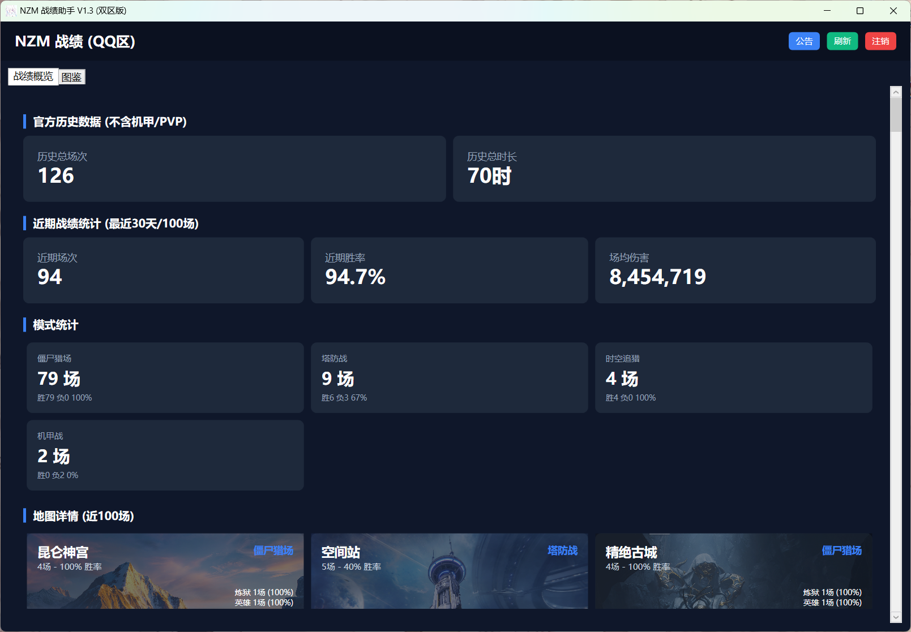
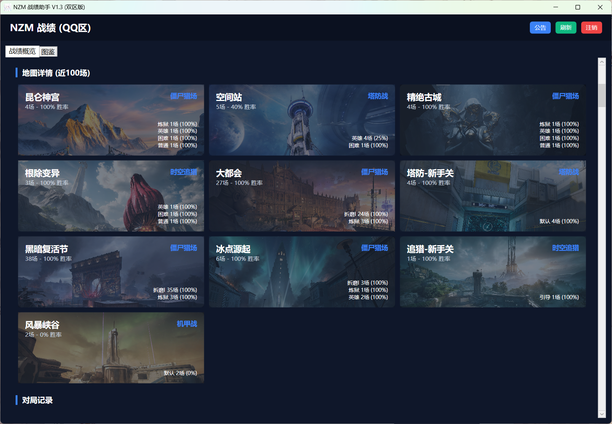
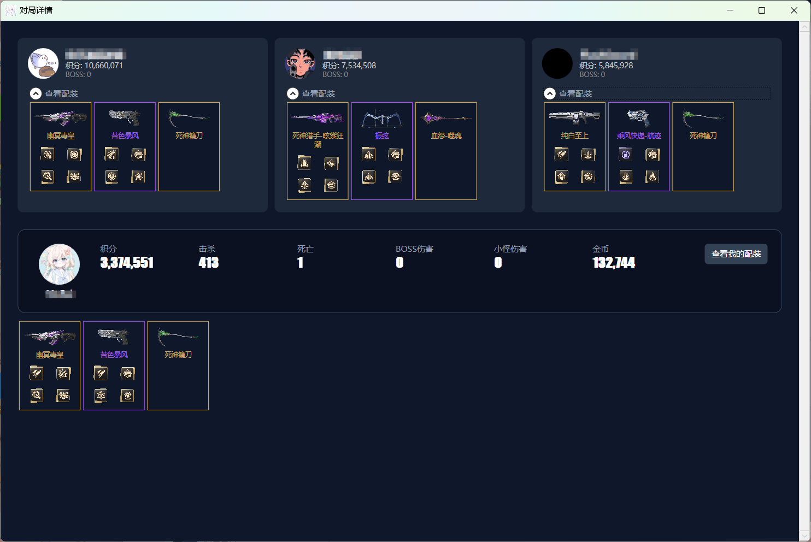

<div align="center">
  
  <h1 align="center">NZM 战绩助手 (NZM Helper)</h1>

  <p align="center">
    一款基于 .NET 8 + WPF 构建的现代化逆战战绩查询工具。
    <br />
    <span style="color: #3b82f6; font-weight: bold;">(由原 Python 版本完全重构迁移至 C#)</span>
    <br />
    <br />
    <a href="http://mobaiya.icu/"><strong>作者博客</strong></a>
    ·
    <a href="#下载">下载最新版</a>
    ·
    <a href="https://github.com/MoBai-Curt/NZM-Stats-Tool/issues">报告 Bug</a>
  </p>

  <p align="center">
    
    
    
    
    
  </p>
</div>

## 📖 简介

**NZM 战绩助手** 是一款专为逆战玩家打造的战绩查询与数据分析工具。
本项目是 **基于原 Python 版本进行的完全 C# 重构版**。相比原脚本，C# WPF 版本拥有原生的图形界面、更低的内存占用以及更快的并发处理速度，无需配置 Python 环境，开箱即用。

## ✨ 核心功能与技术升级

### ⚡ 技术栈迁移 (Python → C#)
* **零环境依赖**：告别繁琐的 Python 环境配置，单文件 exe 直接运行。
* **性能飙升**：利用 .NET 8 的高性能 `HttpClient` 和 `Task` 并发，图片与数据加载速度飞跃提升。
* **原生体验**：更加稳定、流畅的 WPF 交互体验，支持高分屏适配。

### 🛠️ 功能特性
* **🔐 双区支持**：完美支持 QQ (扫码登录) 与 微信 (Cookie 登录) 双大区。
* **📊 深度统计**：
    * 展示历史总场次、时长。
    * **近 30 天 / 100 场** 的详细胜率、场均伤害分析。
    * **模式细分**：僵尸猎场、塔防、机甲战等模式独立统计。
* **🔍 对局细节重制**：
    * **全新 UI**：主武器与插件分层展示，布局清晰。
    * **深度解析**：一键查看队友或大佬的详细配装（支持查看具体插件名称、图标及品质）。
* **🧩 碎片监控**：新增独立悬浮窗，游戏内可置顶实时监控碎片刷取进度。
* **🔫 全面图鉴**：武器、插件、塔防陷阱图鉴一键查看，支持按品质筛选，缺什么一目了然。

## 📸 界面预览

| 登录界面 | 战绩概览 |
|:---:|:---:|
|  |  |

| 详细数据 (新版) | 图鉴系统 |
|:---:|:---:|
|  |  |

## 🚀 快速开始

### 安装运行
1.  前往 [Releases](../../releases) 页面下载最新的 `NZM 战绩助手 V1.3.exe`。
2.  **无需安装**，直接双击运行即可（基于 .NET 8 独立发布）。

### 开发构建
如果你想自己编译代码：
1.  克隆本仓库：
    ```sh
    git clone [https://github.com/MoBai-Curt/NZM-Stats-Tool.git](https://github.com/MoBai-Curt/NZM-Stats-Tool.git)
    ```
2.  使用 **Visual Studio 2022** 打开 `NZMHelper.sln` 解决方案。
3.  确保安装了 **.NET 8 SDK** 和 **WPF 开发工作负载**。
4.  选择 `Release` 模式进行生成。

## ⚠️ 免责声明

* 本工具仅供学习与交流使用，**严禁用于任何非法用途**。
* 如果用户将本工具用于非法用途，产生的一切后果由用户自行承担，与作者无关。
* 本工具不包含任何破坏游戏平衡的功能（如外挂、脚本），仅为数据查询工具。
* **本项目完全免费，严禁倒卖！倒卖死全家！**

## 👤 作者信息

* **作者**: MoBai
* **Blog**: [http://mobaiya.icu/](http://mobaiya.icu/)
* **GitHub**: [@MoBai-Curt](https://github.com/MoBai-Curt)

## 🙏 致谢

本项目灵感与核心逻辑参考了原 网页版本：
* **原 网页作者**: HaMan412 ([GitHub](https://github.com/HaMan412))
* 本项目在此基础上进行了 C# 本地化重构、UI 重新设计以及功能扩展。

---
如果觉得这个项目不错，请给一个 ⭐️ **Star** 吧！
