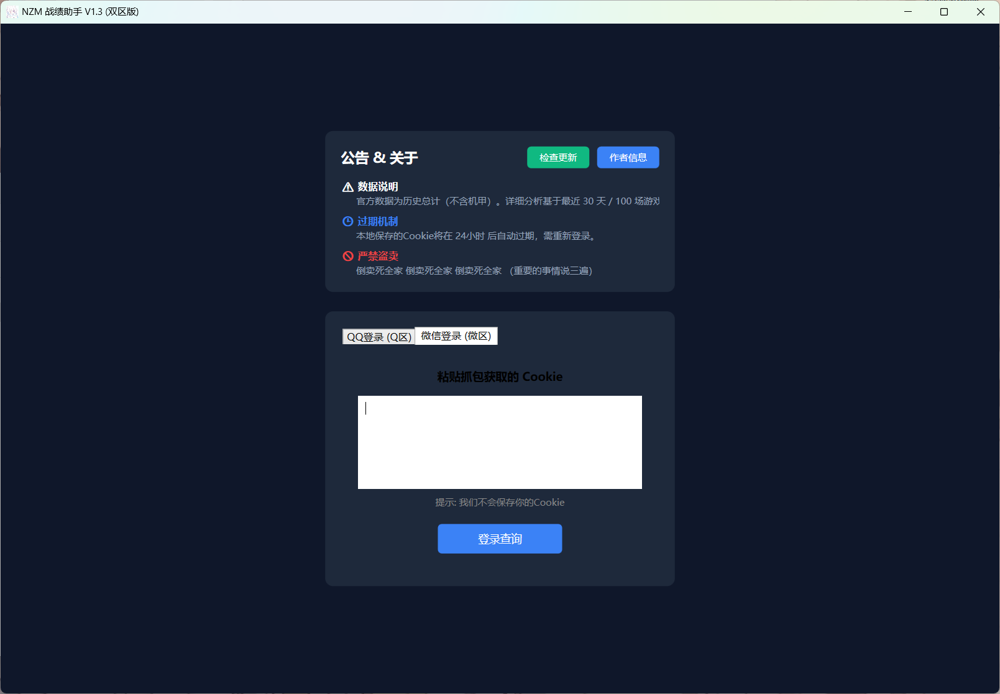
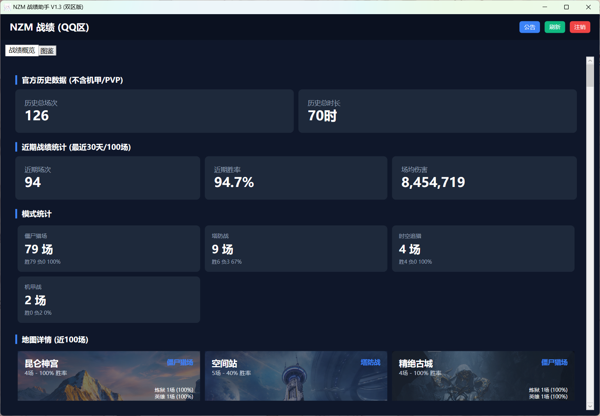
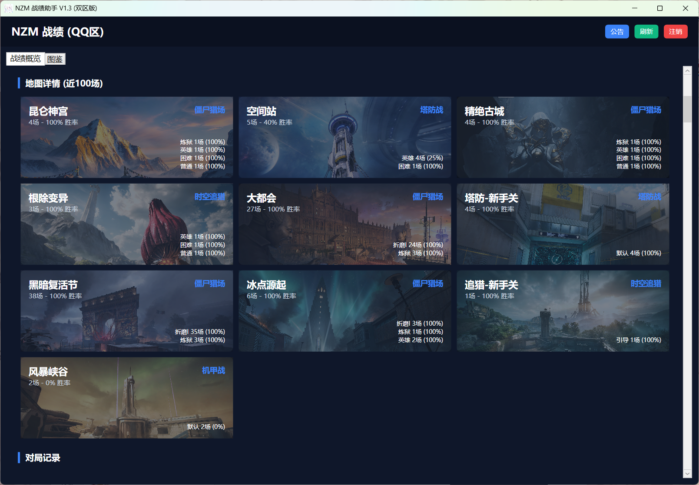
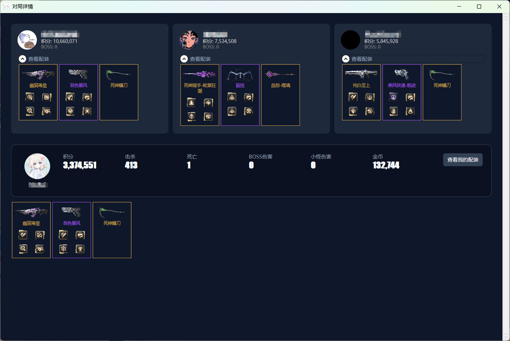

  
  <h1 align="center">🎮 NZM 战绩助手 (NZM-Stats-Tool)</h1>

  

    一款跨平台（PC + Android）的现代化《逆战未来》战绩查询与数据分析工具。 
    告别繁琐的网页跳转与安全风控，为您带来最纯粹的数据查询体验！
     
     
    <a href="http://mobaiya.icu/"><strong>作者博客</strong></a>
    ·
    <a href="https://github.com/MoBai-Curt/NZM-Stats-Tool/releases">下载最新版</a>
    ·
    <a href="https://github.com/MoBai-Curt/NZM-Stats-Tool/issues">报告 Bug</a>
  

  

    
    
    
    
    
    
  

## 📖 项目简介

**NZM-Stats-Tool** 包含两个独立客户端：**Windows 桌面版** 与 **Android 移动版**。
由于官方原扫码网页端严苛的安全风控（WAF）以及移动端底层的协议劫持，常规的 WebView 扫码登录已失效。本项目进行了底层重构，采用了 **“极简纯净的 Cookie 直连模式”** 及 **“原生无感代理抓包”**，彻底解决登录难题。

---

## 💻 Windows 桌面版 (V1.6.0)

桌面版基于 `.NET 8 + WPF` 构建，拥有原生的图形界面、磨砂玻璃特效及深度的数据分析能力。

### ✨ 核心特性
* **⚡ 原生无感抓包**：内置 `Titanium.Web.Proxy` 代理嗅探器，点击按钮即可一键拦截微信小程序流量提取凭证。
* **🧠 智能区服识别**：自动根据凭证特征精准区分 **QQ区** 与 **微信区**，免去手动选择的烦恼。
* **📊 深度数据面板**：
  * 历史总场次、总时长、近期胜率与场均得分趋势。
  * 常玩地图榜单（僵尸猎场/塔防/时空追猎）与各难度通关率。
* **⚔️ 对局与图鉴增强**：
  * **专属数据栏**：详情页高亮显示本人 KDA 与伤害，自动去重队友数据。
  * **配装可视化**：直观展示单局所有玩家的武器及镶嵌插件配置。
  * **碎片监控**：支持图鉴收集进度查询，并提供可置顶的碎片实时监控悬浮窗。

### 📸 桌面端预览
| 极简登录 (支持一键抓包) | 数据大盘与战绩概览 |
|:---:|:---:|
|  |  |

| 详细数据 (专属数据栏) | 图鉴系统 |
|:---:|:---:|
|  |  |

---

## 📱 Android 移动版

移动端基于原生 `Kotlin` 构建，是一款非官方、极简纯净的战绩查询 App。无内置 WebView、无第三方 SDK、体积极致轻量。

### ✨ 核心特性
* **🛡️ 纯净直连模式**：无视风控，将获取到的 Cookie 粘贴即刻直连官方数据接口。
* **🧠 智能凭证路由**：完美兼容以下三端鉴权体系，自动清洗并提取关键参数：
  * **微信小程序** (`ieg_ams_token` 体系)
  * **QQ 互联/小程序** (`access_token` 体系)
* **⚡ 极致轻量**：去除了所有无关的登录跳转代码，启动秒开，内存占用极低。

---

## 🚀 快速开始与使用指南

### 方案 A：使用 PC 端（全自动一键登录）
1. 前往 [Releases](../../releases/latest) 页面下载 `NZM战绩查询_v1.6.0.exe` (绿色单文件，免安装)。
2. ⚠️ **必须【右键 -> 以管理员身份运行】** (否则网络拦截器将因权限不足启动失败)。
3. 在界面中选择区服，点击大按钮 **“开启自动抓取”**。
4. 在电脑上打开微信，进入 **“逆战未来工具箱”** 小程序并点击战绩页，软件将瞬间捕获凭证并登入！

### 方案 B：使用 Android 端（半自动直连）
1. **获取凭证**：
   * **推荐方法**：在电脑上运行 `NZM战绩查询工具.exe`，成功抓取 Cookie 后，点击复制并发送到您的手机。
   * **备用方法**：在手机端使用 Alook 浏览器等抓包工具，登录官方活动页提取请求头中的 `Cookie`。
2. **一键直连**：打开安卓版 NZMHelper，将 Cookie 粘贴至首页输入框。
3. **查战绩**：点击“提取凭证并登录”，App 瞬间完成智能解析并进入战绩视图。

> **排错指南 (FAQ)**：
> * **PC 端抓不到数据**：请检查您的电脑是否开启了 **VPN、梯子、游戏加速器 (如 TUN 全局模式)**。代理软件会劫持本地流量，请**暂时关闭它们**后再试。

---

## 🛠️ 源码构建与开发

如果你想自己编译代码：
1. 克隆本仓库：`git clone https://github.com/MoBai-Curt/NZM-Stats-Tool.git`
2. **PC 端编译**：使用 Visual Studio 2022 打开 `NZMHelper.sln`，确保安装了 `.NET 8 SDK` 和 `WPF 开发工作负载`。
3. **Android 端编译**：使用 Android Studio Hedgehog 或更高版本打开 `Android` 目录，同步 Gradle 后即可运行。

---

## ⚠️ 免责声明 (Disclaimer)

**请务必阅读：**
1. 本项目为个人学习与技术交流的开源产物，**完全免费，严禁倒卖**！
2. 本软件为纯本地客户端工具，**非外挂、不修改任何游戏内存数据**，所有数据均通过合法的官方开放接口读取，**绝不上传、收集或存储用户的任何个人隐私及账号密码**。
3. 若因用户使用不当（如滥用接口、随意泄露个人 Token/Cookie 给他人等）导致的账号安全问题或封禁，**本项目及作者概不负责，后果由用户自行承担**。

---

## 📜 开源协议与引用说明 (License & Open Source Statement)

本项目鼓励技术交流与共建，但坚守开源精神。
**任何基于本项目源代码进行二次开发、引用或衍生出的后续项目，都必须同样遵循开源原则，公开其源代码。** 禁止将本项目的代码用于任何闭源的商业或非商业项目中。

> **Open Source Requirement for Derivative Works:** > We encourage technical exchange and contribution, but we stand firmly by the spirit of open source. **Any subsequent projects derived from, referencing, or built upon the source code of this project MUST also be open-sourced and make their source code publicly available.** Incorporating this project's code into closed-source projects (commercial or non-commercial) is strictly prohibited.

---

## 👨‍💻 作者信息

* **Author**: MoBai
* **Blog**: [http://mobaiya.icu/](http://mobaiya.icu/)
* **GitHub**: [@MoBai-Curt](https://github.com/MoBai-Curt)

### 🙏 致谢
PC 端早期灵感与核心接口逻辑参考了网页版作者：HaMan412 ([GitHub](https://github.com/HaMan412))。本项目在此基础上进行了跨平台重构、UI 全新设计与抓包底层的全面升级。

---
💡 如果这个硬核工具对你有帮助，请在右上角点一个 ⭐️ **Star** 支持一下作者！
